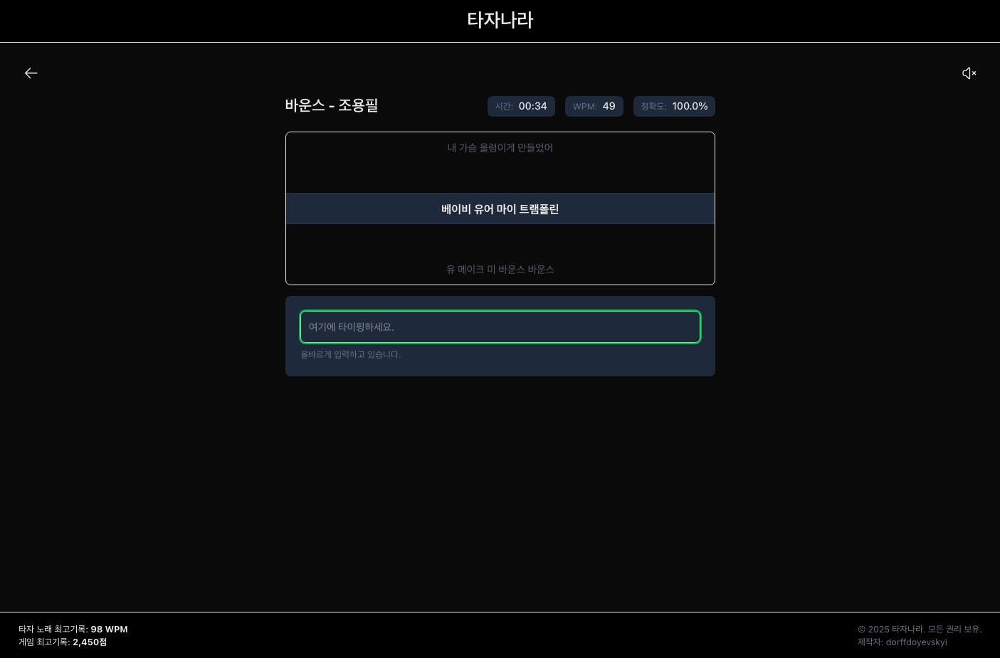

# 타자나라

[링크](https://tajanara.vercel.app/)


## 소개 (Introduction)

타자나라는 노래 가사, 게임 등을 통해 타자 연습을 할 수 있는 웹 애플리케이션입니다. 다양한 방식으로 타자 속도와 정확도를 향상시킬 수 있습니다.

Tajanara is a web application for typing practice through song lyrics, games, and more. It helps improve typing speed and accuracy in various ways.

## 기술 스택 (Tech Stack)

[](https://nextjs.org/)
[](https://reactjs.org/)
[](https://www.typescriptlang.org/)
[](https://tailwindcss.com/)
[](https://tanstack.com/query/latest)
[](https://eslint.org/)
[](https://heroicons.com/)

## 기능 (Features)

### 노래 가사 타자 연습 (Song Lyrics Typing Practice)
- 다양한 노래 가사를 통한 타자 연습
- 실시간 WPM(분당 타자 수), 정확도, 소요 시간 측정
- 가사 진행 상황을 시각적으로 표시

### 게임을 통한 타자 연습 (Game-based Typing Practice)
- 게임 형식의 타자 연습으로 재미있게 실력 향상
- 다양한 난이도와 테마 제공
- 점수 시스템을 통한 동기 부여

### 타건음 설정 (Keyboard Sound Settings)
- 다양한 타건음 선택 가능
- 음량 조절 기능
- 음소거 옵션

### 언어 설정 (Language Settings)
- 한글 타자 연습 지원
- 영문 타자 연습 지원
- 언어 전환 기능

### 랭킹 시스템 (Ranking System)
- 글로벌 스코어 랭킹 확인
- 최고 기록 보기
- 다른 사용자와의 실력 비교

### 개인 기록 관리 (Personal Records)
- 로컬 스토리지 기반의 개인 기록 저장
- 연습 결과 히스토리 확인
- 시간에 따른 실력 향상 추적

## 설치 및 실행 방법 (Installation and Usage)

```bash
# 저장소 클론
git clone https://github.com/yourusername/tajanara.git

# 디렉토리 이동
cd tajanara

# 의존성 설치
npm install

# 개발 서버 실행
npm run dev

# 빌드
npm run build

# 프로덕션 서버 실행
npm run start
```

## 프로젝트 구조 (Project Structure)

```
tajanara/
├── docs/                  # 문서 및 이미지
├── public/                # 정적 파일
├── src/                   # 소스 코드
│   ├── app/               # Next.js App Router
│   │   ├── api/           # API 라우트
│   │   ├── components/    # 공통 컴포넌트
│   │   ├── context/       # 컨텍스트 API
│   │   ├── lyrics/        # 가사 타자 연습 페이지
│   │   ├── result/        # 결과 페이지
│   │   ├── shared/        # 공유 유틸리티 및 데이터
│   │   └── ...            # 기타 페이지 및 컴포넌트
│   └── ...
├── package.json           # 프로젝트 의존성 및 스크립트
└── README.md              # 프로젝트 문서
```

## 라이선스 (License)

MIT
